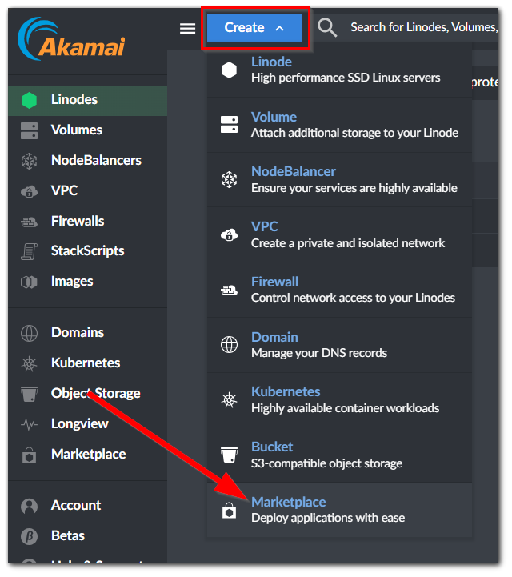
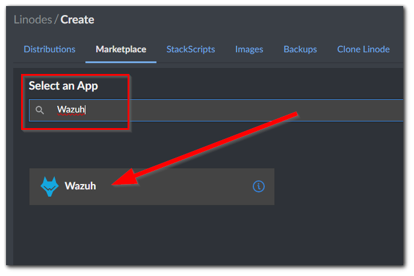
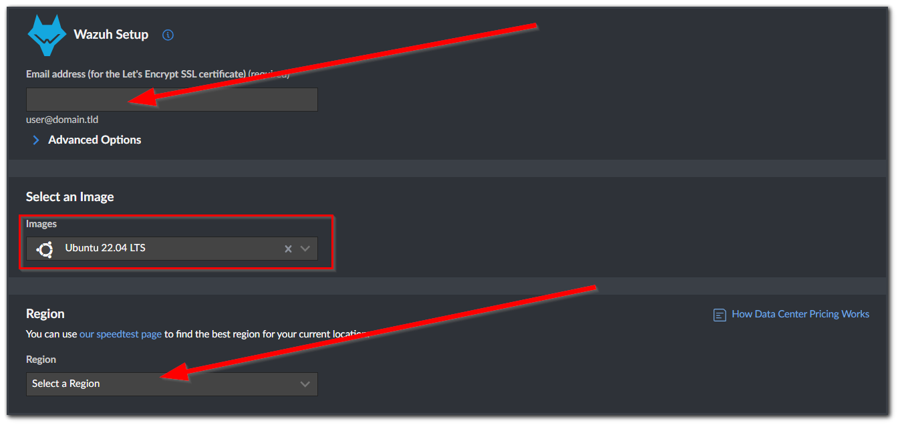
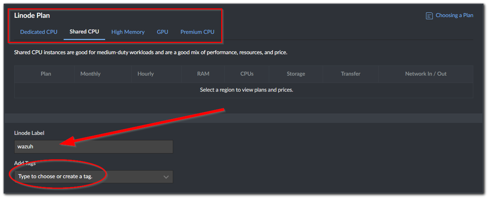
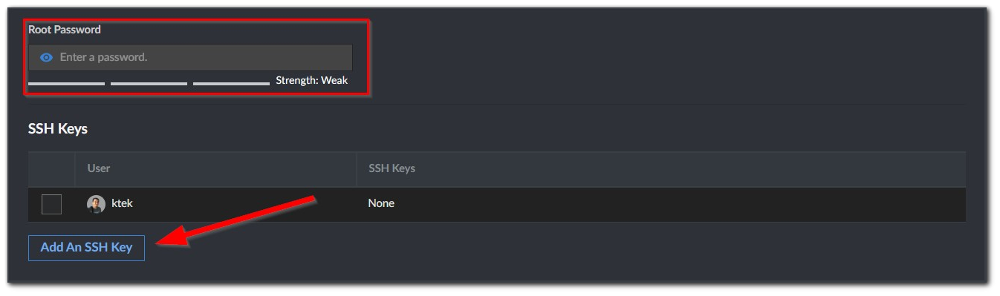
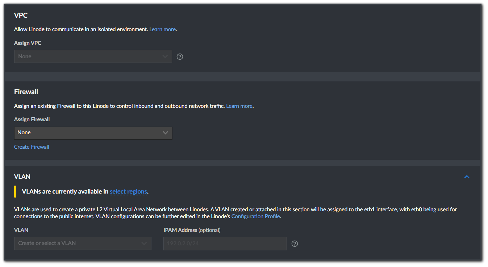
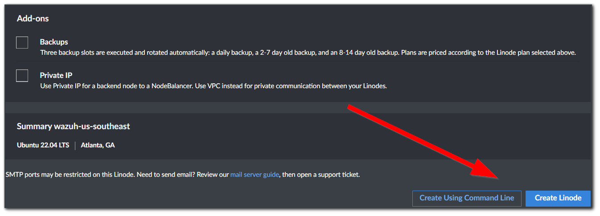

## Creating the Wazuh server.

Head over to Linode and register if you haven't already, otherwise, sign in and select the **Create** button then choose **Marketplace**. 

From the **Marketplace** search for **Wazuh** and select the app from the result. 

The **next steps** will walk you through on how you can setup your **Wazuh server**.

Enter your **email address** for the **SSL certificate** configuration.\
By default, the **Wazuh** app from the **Marketplace** uses an **Ubuntu 22.04 LTS** as your base **Operating System**. \
If you have a ***preferred OS***, those steps will not be covered on this Lab. \
Select a **Region** that you want your server to be hosted on. Ideally this should be closest to your location or end users location, select an option that is in the US if you are in the US. 

The next step is to choose your **Linode Plan**, if this is for a production server it is recommended not to use the **Shared CPU** option but for our **Use Case**, we will opt for Shared CPU for cheaper pricing. 
Visit [Linode Pricing ](https://www.linode.com/pricing/) for more information about pricing. \

You will be asked to **CREATE** your ***Root password***, make sure that you will save this to login to the server once it is created, you can also add your own **SSH Key** but it is optional. 

Next step is about **Networking**, you can assign this server to a **VPC** if you need to. \
You can also assign this to an existing **Firewall rule** you have in **Linode** or **Create** one, leaving this to **None** will open the *Inbound and Outbound connection open to everything*.

Finally, you can choose to enable some **Add-ons**. \
Once done, choose **Create Linode** to create your **Wazuh server**. This will take a few minutes as Wazuh will be need to be installed. \
This is the best time to refill your coffee ☕

